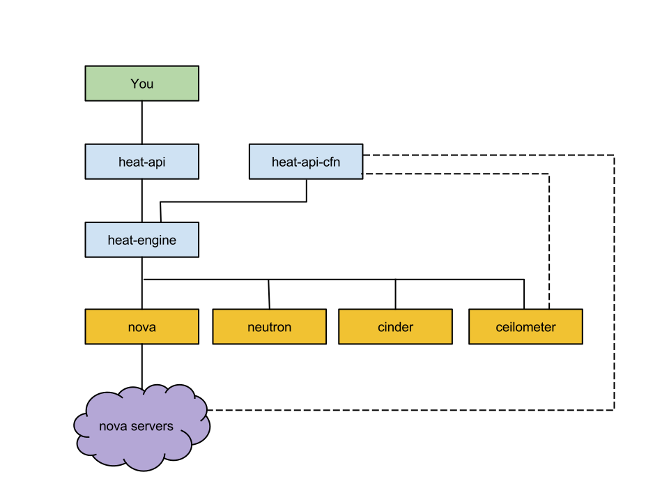
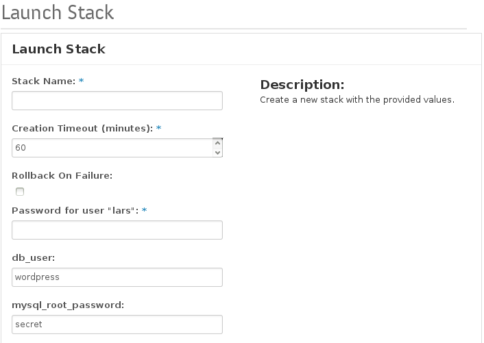
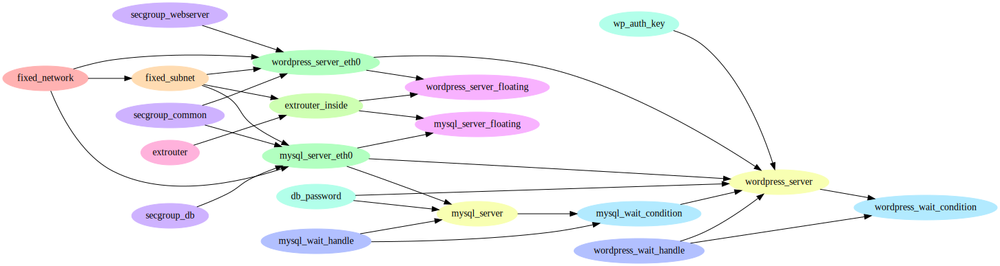

# Deploying with Heat

September 5, 2014  
Lars Kellogg-Stedman <lars@redhat.com>  
<http://goo.gl/u1qURE>

---

## What are we going to do today?

- Brief overview of Heat
- Learn about Heat template syntax
- Look at increasingly complex templates until our heads explode.

Well, hopefully not that last bit.

---

This will all look very similar to [the official examples][1].

[1]: https://github.com/openstack/heat-templates/

---

## Tools and technology

Everything in this presentation was run on:

- Fedora 20
- RDO Icehouse packages

To try this out on your own you will need the above and:

- A functioning Heat installation
- A functioning Ceilometer installation

---

# What is [Heat][]?

[heat]: https://wiki.openstack.org/wiki/Heat

---

## Orchestration

What does that even mean?

> "Orchestration" is the "automated arrangement, coordination, and
> management of complex computer systems" ([wikipedia][1])

Heat provides a mechanism for orchestrating OpenStack resources
through the use of modular templates.

[1]: http://en.wikipedia.org/wiki/Orchestration_(computing)

---

---

## Architecture overview

Heat consists of several components:

- `heat-api` -- provide the REST API.
- `heat-api-cfn` -- provides EC2 CloudFormation API
- `heat-engine` -- the business end

---

## Architecture overview

---

## Configuration notes

Read [about authentication][1].  You will need to:

- Create a keystone v3 heat domain
- Create a domain admin
- Configure `/etc/heat/heat.conf` with:
  - `stack_domain_admin_password`
  - `stack_domain_admin`
  - `stack_user_domain`

[1]: http://hardysteven.blogspot.co.uk/2014/04/heat-auth-model-updates-part-2-stack.html

---

# Templates

---

## Template syntax: Overview

Heat processes templates written in "Heat Orchestration Template"
(HOT) format.

- Written with [YAML][] syntax
- Fully documented in the [HOT specification][hot spec]

Heat can also use templates in AWS CloudFormation template format.

[hot spec]: http://docs.openstack.org/developer/heat/template_guide/hot_spec.html
[yaml]: http://en.wikipedia.org/wiki/YAML

---

## YAML primer

This is a list:

    people:
      - alice
      - bob

So is this:

    people: [alice, bob]

---

## YAML primer

This is a map (aka "dictionary"):

    passwords:
      alice: secret
      bob: 12345678

So is this:

    passwords: {alice: secret, bob: 12345678}

---

## YAML primer

Block text, folding newlines:

    description: >
      This is a
      single line of text.

      And this is
      another.

Renders to:

    This is a single line of text.
    And this is another.

---

## YAML primer

Block text, preserving newlines:

    configure_script: |
      #!/bin/sh

      FLAGFILE="/tmp/flagfile"

      echo "hello world"
      date > $FLAGFILE

---

## Template syntax: Functions

Templates may include certain [intrinsic functions][].  For example,
`get_param` looks up parameters:

     image: {get_param: my_image_name}

If you are thinking to yourself, "Hey, that looks like a YAML
dictionary!"...yes, yes it does.

[intrinsic functions]: http://docs.openstack.org/developer/heat/template_guide/hot_spec.html#intrinsic-functions

Corollary: watch your spelling:

    image: {get_pram: my_image_name}

Yields:

    ERROR: Property error : my_server: image Value must be a string

---

## Template structure

Templates have three sections:

    # This is required.
    heat_template_version: 2013-05-23

    parameters:
      # parameters go here

    resources:
      # resources go here (this section is required)

    outputs:
      # outputs go here

---

## Templates: Resources

The `resources` section specifies what resources Heat should create.

    resources:

      my_resource_id:
        type: a_resource_type
        properties:
          property1: ...
          propert2: ...

For example:

    resources:

      my_server:
        type: "OS::Nova::Server"
        properties:
          image: fedora-20-x86_64-updated
          flavor: m1.small
          key_name: lars
          networks:
            - network: 18fc1b31-9b2c-4b6e-8dea-7e04bfd1eb43

---

## Templates: Resources

Resources can depend on other resources.  Explicitly:

    my_server:
      type: "OS::Nova::Server"
      depends_on: my_network

And implicitly:

    my_server:
      type: "OS::Nova::Server"
      properties:
        networks:
          - network: {get_resource: my_network}

---

## Templates: Resource documentation

Online documentation includes list of [available resource types][1].
You're going to refer to that document *all the time*.

[1]: http://docs.openstack.org/developer/heat/template_guide/openstack.html

---

## Templates: Resource documentation

You can also query Heat for information about available resource types:

    $ heat resource-type-list
    +------------------------------------------+
    | resource_type                            |
    +------------------------------------------+
    [...]
    | OS::Nova::FloatingIP                     |
    | OS::Nova::FloatingIPAssociation          |
    | OS::Nova::KeyPair                        |
    | OS::Nova::Server                         |
    [...]

---

## Templates: Resource documentation

And for information about a specific type:

    $ heat resource-template OS::Nova::FloatingIP
    HeatTemplateFormatVersion: '2012-12-12'
    Outputs:
      ip: {Description: Allocated floating IP address., Value: '{"Fn::GetAtt": ["NovaFloatingIp",
          "ip"]}'}
      pool: {Description: Pool from which floating IP is allocated., Value: '{"Fn::GetAtt":
          ["NovaFloatingIp", "pool"]}'}
    Parameters:
      pool: {Description: Allocate a floating IP from a given floating IP pool., Type: String}
    Resources:
      NovaFloatingIp:
        Properties:
          pool: {Ref: pool}
        Type: OS::Nova::FloatingIP

---

## Templates: Parameters

Recall this example:

    resources:

      my_server:
        type: "OS::Nova::Server"
        properties:
          image: fedora-20-x86_64-updated
          flavor: m1.small
          key_name: lars
          networks:
            - network: 18fc1b31-9b2c-4b6e-8dea-7e04bfd1eb43

- Works just fine on my system...
- ..but not much good for you.

We want to write portable, reusable templates that do not hardcode
information about your local environment.

---

## Templates: Parameters

We can replace hardcoded values with *parameters*:

    parameters:

      image:
        type: string
        default: fedora
        description: >
          image name or id used to boot our nova servers

We can refer to that parameter with the `get_param` function:

    resources:

      my_server:
        type: "OS::Nova::Server"
        properties:
          image: {get_param: image}
          flavor: m1.small
          key_name: lars
          networks:
            - network: 18fc1b31-9b2c-4b6e-8dea-7e04bfd1eb43

---

## Templates: Parameters

Parameters can have:

- Types (string, number, comma_delimited_list, json, or boolean)
- Descriptions
- Constraints ("must be less than", "must be one of the following
  values", etc)
- Hints and help for UI display

Details in the [hot specification][1].

[1]: http://docs.openstack.org/developer/heat/template_guide/hot_spec.html#parameters-section

---

## Templates: Parameters

When creating a stack, parameters can be specified:

- On the command line with `-P`:

        heat stack-create -f my_stack.yaml  \
          -P "image=fedora-20-x86_64-updated" my_stack

- On the command line using an *environment file*:

        heat stack-create -f my_stack.yaml \
          -e my_env.yaml my_stack

---

## Environment files

An environment file is a YAML file with a `parameters` section
containing values for parameters declared in your template:

    parameters:
      image: fedora-20-x86_64-updated

---

---

## Templates: Outputs

Sometimes we want to extract information about a stack:

    outputs:
      server_ip:
        description: fixed ip assigned to the server
        value: { get_attr: [my_server, first_address] }

These can be retrieved via `heat output-list` and `heat output-show`
commands (and via API).

For example:

    $ heat output-list my_stack
    +------------+---------------------------------+
    | output_key | description                     |
    +------------+---------------------------------+
    | server_ip  | fixed ip assigned to the server |
    +------------+---------------------------------+

    $ heat output-show my_stack server_ip
    "10.0.0.26"

---

# Example 1

Simple example is simple.

---

We will be using the [simple.yaml][1] template.  To run through this
example yourself, you will need:

- An ssh key already configured in Nova (`key_name`)
- An image of some sort in Glance (`image`)
- An available Neutron network (`network_id`)

[1]: https://github.com/larsks/rdo-hangout-heat-intro/blob/master/templates/simple.yaml

---

Create the stack:

    $ heat stack-create -f simple.yaml \
      -P "image=cirros;key_name=lars;network_id=18fc1b31-9b2c-4b6e-8dea-7e04bfd1eb43" \
      rdo-stack-1

    +-----...+--------------+--------------------+----------------------+
    | id  ...| stack_name   | stack_status       | creation_time        |
    +-----...+--------------+--------------------+----------------------+
    | a1dc...| rdo-stack-1  | CREATE_IN_PROGRESS | 2014-09-04T21:01:59Z |
    +-----...+--------------+--------------------+----------------------+

---

Verify the stack has been created successfully:

    $ heat stack-list
    +-----...+--------------+-----------------+----------------------+
    | id  ...| stack_name   | stack_status    | creation_time        |
    +-----...+--------------+-----------------+----------------------+
    | a1dc...| rdo-stack-1  | CREATE_COMPLETE | 2014-09-04T21:01:59Z |
    +-----...+--------------+-----------------+----------------------+

---

We can see the resources associated with this stack:

    $ heat resource-list rdo-stack-1
    +---------------+------------------+-----------------+----------------------+
    | resource_name | resource_type    | resource_status | updated_time         |
    +---------------+------------------+-----------------+----------------------+
    | my_server     | OS::Nova::Server | CREATE_COMPLETE | 2014-09-04T21:01:59Z |
    +---------------+------------------+-----------------+----------------------+

---

We can see the outputs associated with this stack:

    $ heat output-list rdo-stack-1
    +------------+---------------------------------+
    | output_key | description                     |
    +------------+---------------------------------+
    | server_ip  | fixed ip assigned to the server |
    +------------+---------------------------------+

---

We can verify that this did, indeed, create a server:

    $ nova list
    +----------...+------------------------------------+--------+------------+-------------+----------------+
    | ID       ...| Name                               | Status | Task State | Power State | Networks       |
    +----------...+------------------------------------+--------+------------+-------------+----------------+
    | cd6f1227-...| rdo-stack-1-my_server-qcep7tfnnlqe | ACTIVE | -          | Running     | net0=10.0.0.29 |
    +----------...+------------------------------------+--------+------------+-------------+----------------+

---

## When things go wrong

If you see:

    $ heat stack-list
    +-----...+--------------+-----------------+----------------------+
    | id  ...| stack_name   | stack_status    | creation_time        |
    +-----...+--------------+-----------------+----------------------+
    | 1e72...| my_stack     | CREATE_FAILED   | 2014-09-04T21:11:28Z |
    +-----...+--------------+-----------------+----------------------+

---

## When things go wrong

You can query Heat for information about the problem:

    $ heat stack-show my_stack
    | stack_status         | CREATE_FAILED                                          |
    | stack_status_reason  | Resource CREATE failed: NeutronClientException: Unable |
    |                      | to find network with name '018d70dd-67b8-4901-8bdd-    |
    |                      | 0c62b06cce2d'                                          |

---

## When things go wrong

As a server administrator, `/var/log/heat/engine.log` is going to be
your best source of information.

---

# Example 2

It's all in the timing.

---

We will be using the [wp-naive.yaml][1] template.  To use this on
your own, you will need:

- A Fedora image (or similar) in Glance (`server_image`)
- An available Neutron external network (`external_network_id`)
- An ssh key configured in Nova (`ssh_key_name`)

Put these all in an *environment file* and name it `local.yaml`.

[1]: https://github.com/larsks/rdo-hangout-heat-intro/blob/master/templates/wp-naive.yaml

This template (attempt to) will create:

- A Neutron network
- A Neutron subnet
- A Neutron router
- A random string to be used as a database password
- A random string to be used as an authentication key
  in wordpress.
- A database server running MySQL
- A webserver running Apache and Wordpress

---

Create the stack:

    $ heat stack-create -f wp-naive.yml -e local.yaml rdo-stack-2

Wait for the stack to complete successfully:

    $ watch heat stack-list

---

Now `resource-list` is a lot more interesting:

    $ heat resource-list rdo-stack-2
    +---------------------------+------------------------------+-----------------+....
    | resource_name             | resource_type                | resource_status |....
    +---------------------------+------------------------------+-----------------+....
    | secgroup_db               | OS::Neutron::SecurityGroup   | CREATE_COMPLETE |....
    | wp_auth_key               | OS::Heat::RandomString       | CREATE_COMPLETE |....
    | db_password               | OS::Heat::RandomString       | CREATE_COMPLETE |....
    | extrouter                 | OS::Neutron::Router          | CREATE_COMPLETE |....
    | fixed_network             | OS::Neutron::Net             | CREATE_COMPLETE |....
    | fixed_subnet              | OS::Neutron::Subnet          | CREATE_COMPLETE |....
    | secgroup_common           | OS::Neutron::SecurityGroup   | CREATE_COMPLETE |....
    | secgroup_webserver        | OS::Neutron::SecurityGroup   | CREATE_COMPLETE |....
    | mysql_server_eth0         | OS::Neutron::Port            | CREATE_COMPLETE |....
    | extrouter_inside          | OS::Neutron::RouterInterface | CREATE_COMPLETE |....
    | wordpress_server_eth0     | OS::Neutron::Port            | CREATE_COMPLETE |....
    | wordpress_server_floating | OS::Neutron::FloatingIP      | CREATE_COMPLETE |....
    | wordpress_server          | OS::Nova::Server             | CREATE_COMPLETE |....
    | mysql_server              | OS::Nova::Server             | CREATE_COMPLETE |....
    | mysql_server_floating     | OS::Neutron::FloatingIP      | CREATE_COMPLETE |....
    +---------------------------+------------------------------+-----------------+....

---

## The problem: symptoms

If you tried to access the Wordpress as soon as
Heat reported `CREATE_COMPLETE`:

    $ heat output-show rdo-stack-2 website_url
    "http://192.168.200.211/wordpress"

You would find:

> Unable to connect
> 
> Firefox can't establish a connection to the server at 192.168.200.211.

---

## The problem: symptoms

Even if Apache was running, you might find that Wordpress was unable
to connect to the database server:

    Error establishing a database connection

---

## The problem: explanation

- Heat reports `CREATE_COMPLETE` as soon as a Nova server has booted.
- It takes time to install and configure something like MySQL or
  Apache.

How can we synchronize our deployment with things happening on our
Nova servers?

---

# Example 3

I wonder what he is sync'ing about

---

We will be using the [wp-simple.yaml][1] template.  This example has
the same requirements and produces the same result as the previous
example.

[1]: https://github.com/larsks/rdo-hangout-heat-intro/blob/master/templates/wp-simple.yaml

This template will create everything we saw in the previous example,
and:

- Wait condition resources to synchronize resource creation

---

## New concept: Wait condition

- Most resources (like `OS::Nova::Server`) transition state
  automatically (`CREATE_IN_PROGRESS` -> `CREATE_COMPLETE`)
- A wait condition (`AWS::CloudFormation::WaitCondition`) is a
  resource that only transitions upon receiving an external signal.

A wait condition looks like this:

    mysql_wait_handle:
      type: "AWS::CloudFormation::WaitConditionHandle"

    mysql_wait_condition:
      type: "AWS::CloudFormation::WaitCondition"
      properties:
        Handle:
          get_resource: mysql_wait_handle
        Timeout: "6000"

---

### Wait condition

This permits us to make parts of our Heat template wait for an
external event before they are created:

    wordpress_server:
      type: "OS::Nova::Server"
      depends_on: mysql_wait_condition

---

### Wait condition

We signal a wait condition using `cfn-signal`, or `curl`.

    mysql_server:
      type: "OS::Nova::Server"
      properties:
        user_data_format: RAW
        user_data:
          str_replace:
            template: |
              #!/bin/sh
              cfn-signal -e0 --data 'OK' \
                -r 'Setup complete' '$WAIT_HANDLE'
            params:
              "$WAIT_HANDLE":
                get_resource: mysql_wait_handle

We can just use `curl` if `cfn-signal` isn't available:

    curl -X PUT -H 'Content-type: application/json' \
      --data-binary '{"Status": "SUCCESS",
                      "Reason": "Setup complete",
                      "Data": "OK",
                      "UniqueId": "0000"}' \
      '$WAIT_HANDLE'

---

## Wait conditions in action

Create the stack:

    $ heat stack-create -f wp-simple.yaml \
      -e local.yaml rdo-stack-3

---

Watch the resources created by the stack:

    $ heat resource-list rdo-stack-3
    +---------------------------+------------------------------------------+--------------------+
    | resource_name             | resource_type                            | resource_status    |
    +---------------------------+------------------------------------------+--------------------+
    [...]
    | mysql_server              | OS::Nova::Server                         | CREATE_COMPLETE    |
    | mysql_server_floating     | OS::Neutron::FloatingIP                  | CREATE_COMPLETE    |
    | wordpress_server_floating | OS::Neutron::FloatingIP                  | CREATE_COMPLETE    |
    | mysql_wait_condition      | AWS::CloudFormation::WaitCondition       | CREATE_IN_PROGRESS |
    | wordpress_server          | OS::Nova::Server                         | INIT_COMPLETE      |
    | wordpress_wait_condition  | AWS::CloudFormation::WaitCondition       | INIT_COMPLETE      |
    +---------------------------+------------------------------------------+--------------------+

---

Heat will not create the `wordpress_server` resource until after the
`mysql_server` server has finished installing and configuring MySQL.

(diagram produced using [dotstack][])

[dotstack]: http://github.com/larsks/dotstack

---

# Example 4

...and Leon's getting laaaarger...

---

We will be using the [wp-scaling.yaml][1] template.  This example has
the same requirements as the previous example.  It produces a Heat
stack that will create a variable number of Wordpress servers
depending on CPU load.

[1]: https://github.com/larsks/rdo-hangout-heat-intro/blob/master/templates/wp-scaling.yaml

This template will create:

- Everything we saw in the previous template
- A "nested stack"
- An autoscaling group to dynamically create/remove servers
- Ceilometer alarms to generate events based on the values of certain
  metrics, and
- Autoscaling policies to respond to those alarms.

---

## New concept: Nested stacks

Heat can treat a template as a resource primitive.

- Allows you to reuse complex configurations in other stacks.
- Create a library of components appropriate to your environment

In this example, [wp-nested-server.yaml][1] is nested inside the
parent stack.

[1]: https://github.com/larsks/rdo-hangout-heat-intro/blob/master/templates/wp-nested-server.yaml

---

## Nested stacks

Stacks are nested by providing a filename or URL as the argument to a
resource's `type` keyword:

      my_server:
        # Here is our nested stack.
        type: wp-nested-server.yaml
        properties:

The filename (or URL) must end with `.yaml`.

---

## New concept: AutoScalingGroup

An AutoScalingGroup is a resource that can create and destroy other
resources on demand.

    wordpress_group:
      type: "OS::Heat::AutoScalingGroup"
      depends_on:
        - mysql_wait_condition
        - extrouter_inside
      properties:
        min_size: 1
        max_size: 3
        resource:
          type: wp-nested-server.yaml

---

## New concept: ScalingPolicy

A ScalingPolicy defines an action that Heat can take on an
AutoScalingGroup.

    web_server_scaleup_policy:
      type: "OS::Heat::ScalingPolicy"
      properties:
        adjustment_type: change_in_capacity
        auto_scaling_group_id:
          get_resource: wordpress_group
        cooldown: 60
        scaling_adjustment: 1

Does nothing by itself; creates an endpoint for external triggers.

---

## New concept: Ceilometer alarms 

Ceilometer is the OpenStack metering agent.  An alarm allows
Ceilometer to `POST` to a URL when a *metric* matches certain values.

<!-- -->

    cpu_alarm_high:
      type: OS::Ceilometer::Alarm
      properties:
        description: Scale-up if the average CPU > 50% for 1 minute
        meter_name: cpu_util
        statistic: avg
        period: 60
        evaluation_periods: 1
        threshold: 50
        alarm_actions:
          - get_attr:
              - web_server_scaleup_policy
              - alarm_url
        matching_metadata:
          'metadata.user_metadata.stack':
            get_param: "OS::stack_id"
        comparison_operator: gt

In this resource definition:

- We retrieve an alarm URL from a previously defined ScalingPolicy.
  Ceilometer will `POST` to this URL when the alarm is triggered.

- We match against specific metadata (`matching_metadata: ...`) in
  order to restrict ourselves to relating to this stack.

- Note that we explicitly assign that metadata in the template:

          metadata: {"metering.stack": {get_param: "OS::stack_id"}}

---

## AutoScaling in Action

Create the stack:

    $ heat stack-create -f wp-scaling.yaml \
      -e local.yaml \
      rdo-stack-4

Wait for the stack to complete.

---

Look at the resources created by this stack:

    $ heat resource-list rdo-stack-4
    [...]
    | wordpress_group             | OS::Heat::AutoScalingGroup               | CREATE_COMPLETE |
    [...]

Everything in `wp-nested-server.yaml` is hidden inside this
AutoScaling group.

What if we want to see it?

    $ heat stack-show rdo-stack-4 wordpress_group | grep physical_resource_id
    | physical_resource_id   | e6c91e4d-0c91-4323-a5c4-f4e597106e29
    $ heat resource-list e6c91e4d-0c91-4323-a5c4-f4e597106e29
    +---------------+-------------------...-----------------------+--------------------+
    | resource_name | resource_type     ...                       | resource_status    |
    +---------------+-------------------...-----------------------+--------------------+
    | lfcobierp5cx  | file:///home/lars/.../wp-nested-server.yaml | CREATE_IN_PROGRESS |
    +---------------+-------------------...-----------------------+--------------------+
    $ heat resource-show e6c91e4d-0c91-4323-a5c4-f4e597106e29 lfcobierp5cx |
      grep phyiscal_resource_id
    | physical_resource_id   | 4c0f6d83-8f97-4cef-8231-d6eab30a28fe

<!-- -->

    $ heat resource-list 4c0f6d83-8f97-4cef-8231-d6eab30a28fe
    +---------------------------+------------------------------------------+--------------------+
    | resource_name             | resource_type                            | resource_status    |
    +---------------------------+------------------------------------------+--------------------+
    | wordpress_wait_handle     | AWS::CloudFormation::WaitConditionHandle | CREATE_COMPLETE    |
    | wordpress_server_eth0     | OS::Neutron::Port                        | CREATE_COMPLETE    |
    | wp_auth_key               | OS::Heat::RandomString                   | CREATE_COMPLETE    |
    | wordpress_server          | OS::Nova::Server                         | CREATE_COMPLETE    |
    | wordpress_server_floating | OS::Neutron::FloatingIP                  | CREATE_COMPLETE    |
    | wordpress_wait_condition  | AWS::CloudFormation::WaitCondition       | CREATE_IN_PROGRESS |
    +---------------------------+------------------------------------------+--------------------+

---

## Looking at alarms

Let's look at the alarms that were created as part of this stack:

    $ ceilometer alarm-list
    +--------------------------------------+-----------------------------------------+-------+...
    | Alarm ID                             | Name                                    | State |...
    +--------------------------------------+-----------------------------------------+-------+...
    | d341e2b2-0725-4f7b-97b7-4957db94748e | rdo-stack-4-cpu_alarm_low-jbdty7rvqrbh  | ok    |...
    | e7379cab-082d-4075-93de-f1658dffb15a | rdo-stack-4-cpu_alarm_high-bxcds4pjzxig | ok    |...
    +--------------------------------------+-----------------------------------------+-------+...

---

Looking at a specific alarm:

    $ ceilometer alarm-show -a e7379cab-082d-4075-93de-f1658dffb15a
    [...]
    | meter_name                | cpu_util                                                                 |
    | name                      | rdo-stack-4-cpu_alarm_high-bxcds4pjzxig                                  |
    | period                    | 60                                                                       |
    | project_id                | 95d9bbd9b446438a89a353d8adb60704                                         |
    | query                     | metadata.user_metadata.stack == 59d654b7-2e2c-490e-93f8-c78437a22b62 AND |
    |                           | project_id == 95d9bbd9b446438a89a353d8adb60704                           |
    | state                     | ok                                                                       |
    [...]

---

Looking at samples used by that alarm:

    $ ceilometer sample-list -m cpu_util \
      -q 'metadata.user_metadata.stack=59d654b7-2e2c-490e-93f8-c78437a22b62'
    +-----------------...+----------+-------+----------------+------+---------------------+
    | Resource ID     ...| Name     | Type  | Volume         | Unit | Timestamp           |
    +-----------------...+----------+-------+----------------+------+---------------------+
    | 409346aa-9506-44...| cpu_util | gauge | 0.233333333333 | %    | 2014-09-05T02:19:41 |
    | 409346aa-9506-44...| cpu_util | gauge | 0.25           | %    | 2014-09-05T02:18:41 |
    | 409346aa-9506-44...| cpu_util | gauge | 0.333333333333 | %    | 2014-09-05T02:17:41 |
    | 409346aa-9506-44...| cpu_util | gauge | 0.3            | %    | 2014-09-05T02:16:41 |
    | 409346aa-9506-44...| cpu_util | gauge | 0.3            | %    | 2014-09-05T02:15:41 |
    | 409346aa-9506-44...| cpu_util | gauge | 0.283333333333 | %    | 2014-09-05T02:14:41 |
    | 409346aa-9506-44...| cpu_util | gauge | 20.8166666667  | %    | 2014-09-05T02:13:41 |
    | 409346aa-9506-44...| cpu_util | gauge | 11.1833333333  | %    | 2014-09-05T02:12:41 |
    | 409346aa-9506-44...| cpu_util | gauge | 13.8           | %    | 2014-09-05T02:11:41 |
    | 409346aa-9506-44...| cpu_util | gauge | 56.5166666667  | %    | 2014-09-05T02:10:41 |
    | 409346aa-9506-44...| cpu_util | gauge | 35.2           | %    | 2014-09-05T02:09:41 |
    +-----------------...+----------+-------+----------------+------+---------------------+

---

## Let's create a new server!

- Log into Wordpress server
- Generate some load
- Watch Heat spin up a new server for us!

---

## But something is missing...

- What address would clients use to contact our server?
- We need a load balancer!

---

# Example 5

Finding our balance.

---

We will be using the [wp-scaling-lb.yaml][1] template.  This example has
the same requirements as the previous example.  It produces a Heat
stack that will create a variable number of Wordpress servers
depending on CPU load, and will manage a load balancer to provide
access to this service.

[1]: https://github.com/larsks/rdo-hangout-heat-intro/blob/master/templates/wp-scaling-lb.yaml

This template will create:

- Everything we saw in the previous template
- A Neutron load balancer

---

## New concept: LoadBalancer

A LoadBalancer resource associates a Neutron pool with zero or more
member servers.

    lb:
      type: "OS::Neutron::LoadBalancer"
      properties:
        protocol_port: 80
        pool_id: {get_resource: pool}

---

## New concept: Pool

A Pool resource manages a Neutron load-balancing pool.

    pool:
      type: "OS::Neutron::Pool"
      properties:
        protocol: HTTP
        monitors:
          - {get_resource: monitor}
        # in more recent versions of Heat this should be simply "subnet"
        subnet_id: {get_resource: fixed_subnet}
        lb_method: ROUND_ROBIN
        vip:
          protocol_port: 80

## New concept: HealthMonitor

A HealthMonitor monitors the connectivity of pool members.  Neutron
will remove a member from a pool if the health check for that member
fails.

    monitor:
      type: "OS::Neutron::HealthMonitor"
      properties:
        type: TCP
        delay: 3
        max_retries: 5
        timeout: 5

---

## New concept: PoolMember

A PoolMember resources assigns a fixed ip address to a Pool.

    member:
        type: "OS::Neutron::PoolMember"
        properties:
          pool_id: {get_param: pool_id}
          address: {get_attr: [wordpress_server, first_address]}
          protocol_port: 80

---

## Load balancing in action

Create the stack:

    $ heat stack-create -f wp-scaling-lb.yaml \
      -e local.yaml \
      rdo-stack-5

Wait for the stack to complete.

---

Verify that we have a load balancer:

    $ neutron lb-pool-list
    +------...+------------...+----------+-------------+----------+----------------+--------+
    | id   ...| name       ...| provider | lb_method   | protocol | admin_state_up | status |
    +------...+------------...+----------+-------------+----------+----------------+--------+
    | 514bd...| rdo-stack-5...| haproxy  | ROUND_ROBIN | HTTP     | True           | ACTIVE |
    +------...+------------...+----------+-------------+----------+----------------+--------+

---

See the member assigns to the pool:

    $ neutron lb-member-list
    +------...+----------+---------------+----------------+--------+
    | id   ...| address  | protocol_port | admin_state_up | status |
    +------...+----------+---------------+----------------+--------+
    | d4f44...| 10.0.0.5 |            80 | True           | ACTIVE |
    +------...+----------+---------------+----------------+--------+

---

Verify that we can contact Wordpress at the load balancer public ip:

    $ eval curl -i $(heat output-show rdo-stack-5 website_url)
    HTTP/1.1 302 Found
    Date: Fri, 05 Sep 2014 13:33:58 GMT
    Server: Apache/2.4.10 (Fedora) PHP/5.5.16
    X-Powered-By: PHP/5.5.16
    Location: http://192.168.200.239/wordpress/wp-admin/install.php
    Content-Length: 0
    Content-Type: text/html; charset=UTF-8

---

# That's all folks!

---

## About this hangout

The slides and templates used in this hangout can be found online at:

- <https://github.com/larsks/rdo-hangout-heat-intro>

